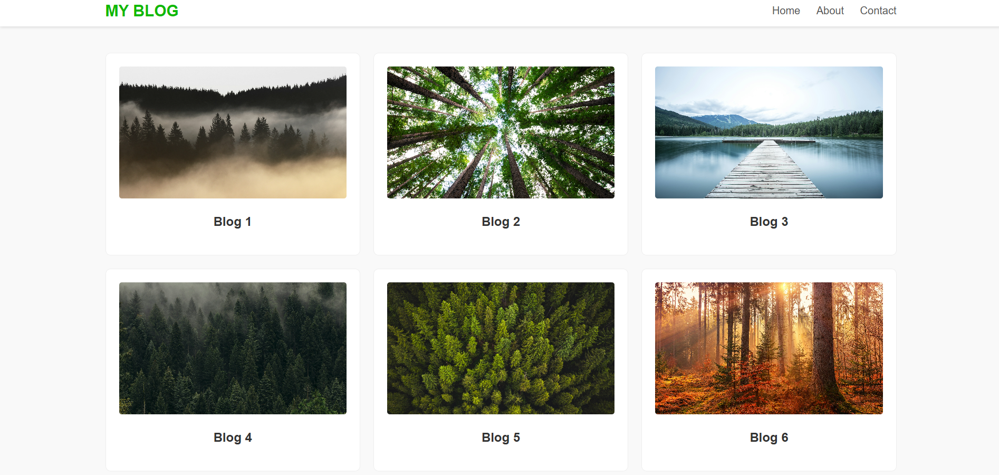

# My Personal Blog 

A modern and minimal **blog website** built with **HTML and CSS**. The blog features a responsive grid layout, smooth navigation, and visually appealing design.

## 🖼️ Preview  
  

## 🚀 Features  
- **Responsive Blog Grid** – Displays blog posts in an elegant, responsive grid layout.  
- **Navigation Bar** – Provides quick access to **Home, About, and Contact** pages.  
- **Clickable Blog Cards** – Each blog post is represented as a card with an image and title.  
- **Minimalist Design** – Clean and modern UI with a focus on readability.  
- **Fully Responsive** – Works seamlessly on desktop, tablet, and mobile devices.  
- **Footer Section** – Displays copyright information.  

## 📜 How It Works  
1. Click on a **blog card** to read the full post.  
2. Use the **navigation bar** to explore different sections of the blog.  
3. The layout adapts to different screen sizes for the best viewing experience.  

## 🛠️ Technologies Used  
- **HTML** – Structure of the blog pages.  
- **CSS** – Styling, grid layout, and responsiveness.
